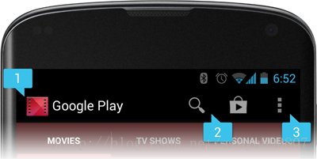
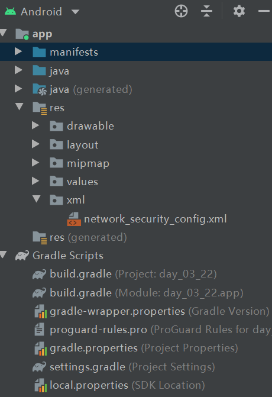

#  Android开发笔记

## Activity篇

### 生命周期(LifeCycle)

---

- `onCreate() `在Activity被创建的时候被调用。
- `onRstart()` 在Activity重新被启动的时候被调用。
- `onStart() `在Activity可见的时候被调用。
- `onStop() ` 在Activity不可见的时候被调用。
- `onResum() ` 在Activity可交互(interfating)的时候被调用。
- `onPause() ` 在Activity不可交互的时候被调用。
- `onDesdroy()  `在Activity被销毁的时候被调用。

### 绑定ui

---

> 为activity绑定视图是通过setContontView()方法来实现的。
>
> setContontView()的参数可以是int类型(xml文件的id),也可以是一个view对象。


### Activity之间的跳转

---

Activity的跳转分为`隐式跳转`和`显示跳转`两种方式，我们可以根据自己的业务需求选择合适的跳转方式；

#### 显示跳转：

Activity之间的跳转需要调用Activity的`startActivity()`方法来实现，调用`startActivity()`方法需要传入`Intent`对象，我们应该在`Intent`对象当中指明跳转的详细信息；

#### 隐式跳转：


#### **代码实例**

```java
Intent intent = new Intent(MainActivity.this,SecondActivity.class);
startActivity(intent);
```


## Service篇

## BroadcastReceiver篇

## ContentProvider篇


## 主题与样式

**样式和主题的区别**

- 作用范围不同

  样式作用在控件上，是局部范围。主题作用在activity或application上。

  样式都在布局文件里配置，主题都在AndroidMainifest文件里配置。


## UI之自定义


## 应用图标适配

在安卓5.0的时候，安卓对通知栏图标的设计进行了修改，要求小图标使用alpha图层，而不是有颜色的rgb图层。

什么是alpha图层呢，通俗的说就是让我们的通知栏图标不带颜色。我们不应该关心小图标的设计，因为这是ui设计师 的工作。


## 用户提醒

### 吐司 Toast

Toast是一种简洁的、用于提示用户消息的视图，它并不获取焦点，因此即使用户正在输入内容也不会受到影响。

---


- **基本使用**

```java
Toast.makeText(MainActivity.this,"我是提示内容"，Toast.LENGTH_SHORT).show();
```

makeText()方法会创建一个默认的Toast实例，这种方式不能使用setText()方法指定提示内容。

---


- **自定义Toast**

  ---

  **基本步骤**

  1. 通过构造方法"Toast(Context context)"获取到Toast的实例。
  2. 通过"setView(View view)"方法设置Toast的视图内容。
  3. 通过show()方法使其显示出来。

  **代码示例**

```java
Toast toast = new Toast(MainActivity.this);
TextView content_tv = new TextView(MainActivity.this);
toast.setView(content_tv);
toast.show();
```


### 对话框 Dialog

### 通知 Notification

发送一条通知的基本消息的基本步骤如下：

step1：通过获取系统服务getSystemService()来实例化NotificationManager

step2：实例化Notification

## 操作栏(Action Bar)


> Action Bar 在Android3.0之后加入到了系统的API中，它具有标识用户当前操作界面位置、界面导航以及用户动作交互等功能。
>
> 与其说是操作栏(Action Bar)不如说是导航栏(Navigation Bar)，它的功能也是正是为用户提供导航的作用。

### Action Bar界面截图




其中，[1]是ActionBar的图标，[2]是两个action按钮，[3]是overflow按钮。


### 添加\删除Action Bar

**添加Acton Bar**

添加Action Bar非常简单，只需在AndroidMainifest文件中的Application标签或者Activity标签中指定一个带Action Bar的主题即可。

```xml
<application
     、、、
     android:theme="@style/Theme.Design"      
     、、、
></application>
```

**删除Action Bar**

删除Action Bar的方式有两种，一种是通过指定不具有Action Bar的主题，另一种是在Activity中调用Acton Bar的hide()方法。

1. 指定不带Action Bar的主题

```xml
<application
             、、、
             android:theme="@style/Theme.Design.NoActionBar"  
             、、、></application>
```

2. 在Activity中调用hide()方法

```java
ActonBar actionBar = new ActionBar();
actionBar.hide();
```


### 修改Action Bar图标以及标题 

同删除和添加Action Bar一样，Action Bar的图标和标题都是定义在AndroidMainifest文件里的。

默认情况下，应用的图标(icon)就是Action Bar的图标，如果想要修改，我们可以通过logo属性来指定Action Bar的图标。

```xml
<activity
          、、、
          android:logo="@drawable\actionbar_share"
          、、、
          ></activity>
```

标题是通过label标签来指定的

```xml
<activity
          、、、
          android:label="@tring\title"
          、、、>

</activity>
```

### 添加Action Bar操作按钮

> 1.Action Bar通过操作按钮(Action Button)来与用户进行交互，这些操作按钮以图片或者文字的方式显示在操作栏上，以达到导航的目的。
>
> 2.当Action Bar中的 按钮过多的时候，部分按钮会隐藏在浮动按钮(Overflow Button)，浮动按钮的图标是三个点，点击一下就会展开隐藏的按钮，展开的内容不是按钮的图标，而是将所有隐藏的按钮的title属性的内容以文本视图的形式显示出来，类似于ListView。

添加动作按钮是通过重写onCreateOptionMenu这个回调方法来实现的，但是在这之前我们应该准备好menu资源文件。

**step1**：在res文件夹下新建一个menu目录，在menu目录下新建一个menu资源文件编写内容

```xml
<?xml version="1.0" encoding="utf-8"?>
<menu xmlns:android="http://schemas.android.com/apk/res/android"
    xmlns:app="http://schemas.android.com/apk/res-auto">
    <item
        android:id="@+id/add"
        android:icon="@drawable/aa"
        android:title="Add"
        app:showAsAction="always" />
    <item
        android:id="@+id/delete"
        android:icon="@drawable/aa"
        android:title="Delete"
        app:showAsAction="always" />
    <item
        android:id="@+id/about"
        android:title="About"
        app:showAsAction="never"/>
</menu>
```

在Menu节点下添加Item标签，每一个Item标签就对应了一个动作按钮。

- Item标签的id属性用于表示按钮的全局唯一标识、icon属性表示按钮的图标。

- title属性表示按钮的标题，对于显示在Action Bar的按钮来说用户长按会弹出一个Toast用于提示title属性的内容。

  对于隐藏的按钮来说，当用户点击overflow按钮时则会弹出一个类似于ListView的视图，在这个视图当中的每一个Item视图就对应Menu的每一个Item，每一个Item视图就会显示对应的title属性的内容。

**step2**：重写onCreateOptionMenu()方法以加载Menu资源

```java
    @Override
    public boolean onCreateOptionsMenu(Menu menu) {
        MenuInflater menuInflater = this.getMenuInflater();
        menuInflater.inflate(R.menu.main_menu,menu);
        return super.onCreateOptionsMenu(menu);
    }
```

获取到MenuInflater的实例后调用其inflate()方法即可。

**注意**： ”return super.onCreateOptionsMenu(menu);“需要在最后执行。

### Action Button点击事件监听

---

Action Button点击事件监听的监听是通过重写Activity的onOptionsItemSelected()方法来实现的。

```java
    @Override
    public boolean onOptionsItemSelected(@NonNull MenuItem item) {
        switch (item.getItemId()){
            case R.id.add:
                Toast.makeText(this,"ADD",Toast.LENGTH_SHORT).show();
                break;
            case R.id.delete:
                Toast.makeText(this,"DELETE",Toast.LENGTH_SHORT).show();
                break;
        }
        return super.onOptionsItemSelected(item);
    }
```

首先通过每一个Item的getItemId()方法获取到Item的ID，再用switch语句编写逻辑事件。

## 安卓大佬推荐

- 郭霖《第一行代码》作者，国内GDE之一，现入职微软(Microsoft)

- 扔物线 国内首个GDE

- 张鸿洋 <a href= "https://www.wanandroid.com/" target="_blank"> WanAndroid</a>网站开发者

- 轮子哥  GitHub造轮子大佬
- <a href="https://space.bilibili.com/137860026?from=search&seid=15855733122778168827">longway777</a>  B站UP主

## 安卓开发书籍推荐

小白入门最佳教材《第一行代码》

初级到中级进阶 《安卓开发艺术探索》

## 自定义组合控件

## 问题总结

### 1. Android8.0以后无法使用HTTP协议

---

报错详情：java.net.SocketException: socket failed: EPERM (Operation not permitted)

**解决方法：**

1. 后台采用HTTPS协议
2. 安卓targetSdkVersion 降到28以下
3. 强制更改网络配置


**强制更改网络配置**

`step1：`在res目录下新建xml目录，在xml目录下新建一个xml文件，名字随意，这里以network_security_config.xml为例进行演示。



`step2：`在network_security_config.xml文件里添加以下内容

```xml
<?xml version="1.0" encoding="utf-8"?>
<network-security-config>
    <base-config cleartextTrafficPermitted="true" />
</network-security-config>
```

`step3：`在AndroidManifest.xml里的application标签添加android:networkSecurityConfig属性，值为：@xml/network_security_config

"@xml/network_security_config"表示对xml目录下的network_security_config.xml文件的引用

```xml
<application
             、、、
             android:networkSecurityConfig="@xml/network_security_config"
             、、、></application>
```


`step4：`一定要把原来的app在安卓设备上`卸载重装`, 否则会失效；


### 2.java.net.SocketException: socket failed: EPERM (Operation not permitted)

---

这个异常通常在一开始没有给应用添加访问网络权限，在添加权限后重新编译运行时产生的。

解决办法：卸载安卓设备上的应用程序重新编译运行。


### 3.在LiveData的回调里getActivity()会报空指针异常

---

