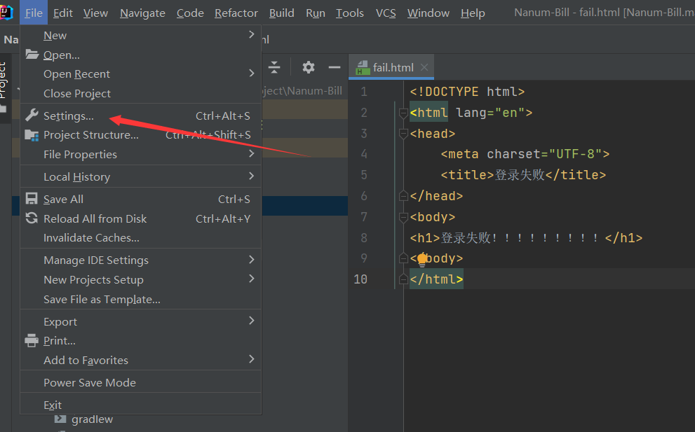
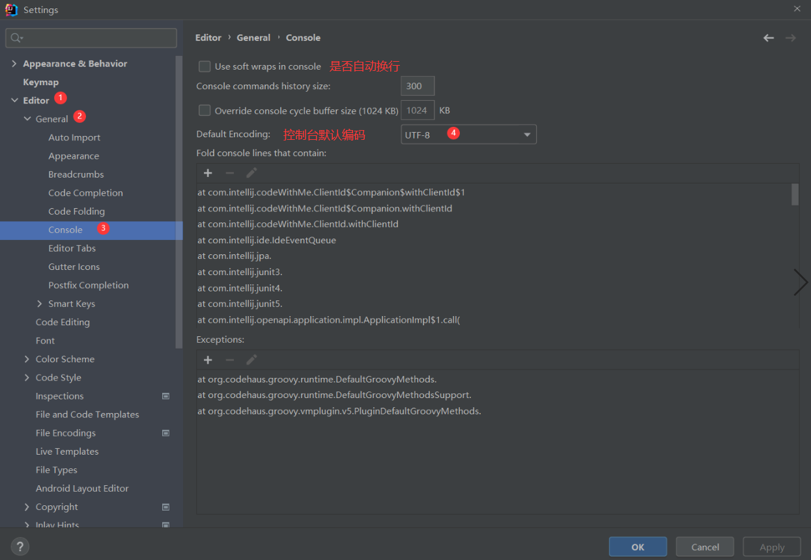
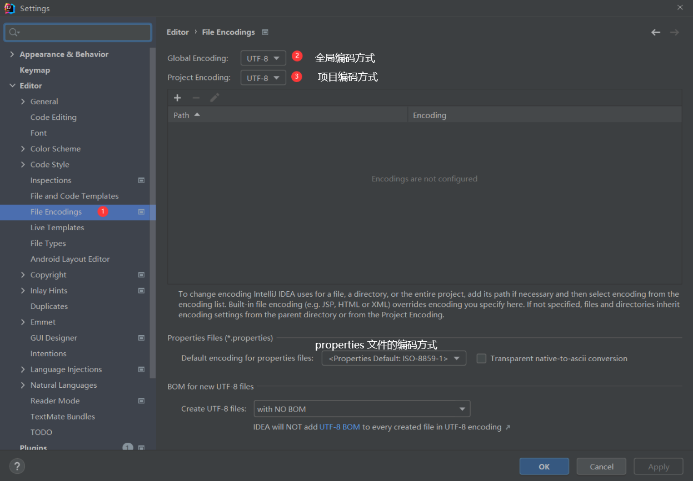

# IDEA使用总结

## 一、

**如图**：


**解决办法**：

第一种：能找到占用端口的进程

1. **找到占用端口号的进程ID**

```
netstat -aon | findstr 端口号
```

2. **杀死该进程**

```
taskkill -f -pid [进程id]
```


第二种：不能找到占用端口的进程

通过 netstat -ano 命令查找所有运行中进程，发现并没有进程占用1099端口，其实是这些端口有可能是被 Hyper-V 保留了；

可能我们电脑开启了`hyper-v`服务，系统默认会分配给一些保留端口供Hyper-V使用，可能与Tomcat冲突

输入netsh interface ipv4 show excludedportrange protocol=tcp命令可查看1099端口是否被 Hyper-V 保留了，这个是查询windows10下面的`Hyper-V`的端口保留的TCP范围；

```
PS C:\Windows\system32> netsh interface ipv4 show excludedportrange protocol=tcp

协议 tcp 端口排除范围

开始端口    结束端口
----------    --------
      5357        5357

* - 管理的端口排除。
```

如果端口号在 Hyper-V 保留的范围内，可以选择保留范围以外的端口号，或者关闭Hyper-V ；


关闭了Hyper-V也不好使。

某些版本的Windows 10，默认的动态端口起始端口号被设置成了1024
通过netsh int ipv4 show dynamicport tcp命令可以进行查看

```
C:\Users\null'pointer>netsh int ipv4 show dynamicport tcp

协议 tcp 动态端口范围
---------------------------------
启动端口        : 1024
端口数          : 13977
```

我们可以看到Windows系统默认的tcp动态端口范围为：1024~13977


通过netsh int ipv4 set dynamicportrange tcp start=49152 num=16384 命令修改配置即可。

重启Tomcat，1099端口号不再被占用。


[参考：](https://bareth.blog.csdn.net/article/details/108465349?utm_medium=distribute.pc_relevant.none-task-blog-2%7Edefault%7ECTRLIST%7Edefault-1.no_search_link&depth_1-utm_source=distribute.pc_relevant.none-task-blog-2%7Edefault%7ECTRLIST%7Edefault-1.no_search_link)


## 二、IDEA设置编码方式

### 1. 控制台设置编码方式

---







### 2. 文件编码方式

---





# [windows任务栏IDEA图标变白色快速解决方法](https://www.codeprj.com/blog/9e3e8d1.html)

**方案1**：同时按Windows键+R键打开运行对话框，输入ie4uinit.exe -show然后回车即可修复。

**方案2**：打开计算机（Win7），此电脑（Win10）或任意文件夹，然后在地址栏输入cmd.exe /c ie4uinit.exe -show然后回车即可。

**方案3**：同时按Windows键+R键打开运行对话框，输入%APPDATA%\Microsoft\Internet Explorer\Quick Launch\User Pinned\TaskBar后回车键

　　　  在弹出的TaskBar文件夹中找到IDEA图标，右击 选中“从任务栏取消固定”，观察任务栏是否有变化，变正常直接锁定到任务栏。多试几次就好了。
