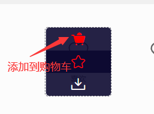
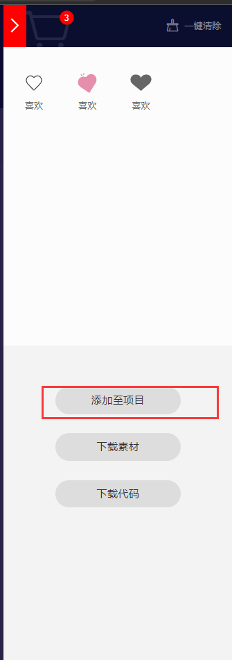
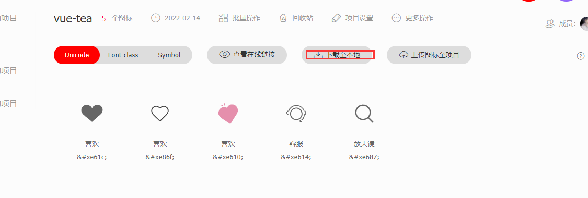

# 字体图标使用方法

# 一、Alibaba IconFont使用方法

**第一步：去[iconfont官网](http://www.iconfont.cn)下载所需的图标；**

- 挑选自己想要的图标加入到购物车：



- 点击打开购物车：

  

- 添加至项目

  

- 下载至本地

  

**第二步：解压文件，在自己的项目当中新建目录：`iconfont`，将解压的内容放入即可；**

**第三步：引入iconfont文件夹中的样式表：`iconfont.css`；**

```html
<link rel="stylesheet" href="iconfont/iconfont.css">
```

**第四步：在要是用字体图标的标签上加上类：iconfont，然后有以下几种方式；**

- 使用类名

```html
<i class="iconfont"></i>
```

- 

