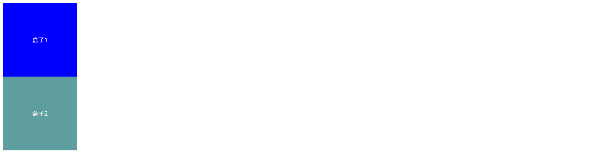

# 总结

# 一、元素居中

### 1、定位+负值margin

```html

<sytle>
    
</sytle>
```

### 2、定位+位移


### 3、弹性盒子


# 二、嵌套崩塌

> 垂直方向的紧挨着的两个元素，如果分别**同时**对其设置上、下外边距，只有较大的值会生效，而不是累加；


- **问题描述**

  如图，两个紧挨着的盒子，如果对盒子1设置50像素的下外边距，对盒子2设置20像素的上外边距，结果只有盒子1的50像素下外边距会生效；

  

- **解决办法**

