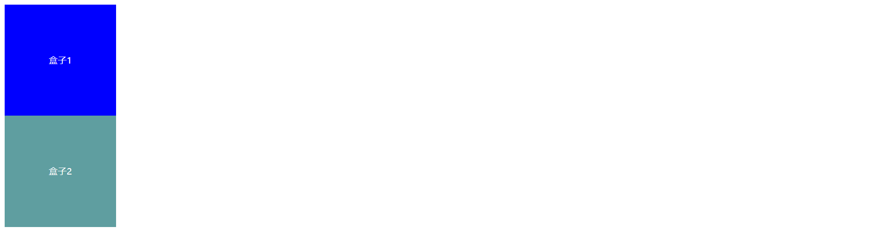

# HTML&CSS基础

## HTML基础

HTML用于描述网页的骨架结构，好比一栋房子使用砖头来搭建骨架的；


### 文本元素

---


### form表单元素

---

form标签是专门用来收集用户填写信息的一种标签，是前端和后端交互的关键元素；


**语法**

```html
<form action="">
    ……
</form>
```

- 务必在`action`属性里填写提交地址(服务器地址)
- 务必使用`method`属性里指定请求方法；
- 每一个表单元素都要起一个name！！！这个name对应的就是提交的参数名称，用户输入的内容就是参数的值，提交之后会在服务器被解析。


**示例详解**

```html
<form action="" method="GET">

        <!-- 单行文本输入框 -->
        用户：<input type="text" name="user"><br>

        <!-- 密码输入框 输入的内容只会被处理在显示，防止他人窥视-->
        密码：<input type="password" name="password"><br>

        <!-- 单选框 -->
        <!-- 使用单选框需要为每一个单选框定义好value属性，每个框对应不同的值，而且每一组单选框的name属性保持一致； -->
        性别：男<input type="radio" name="sex" value="boy"> 女<input type="radio" name="sex" value="girl"><br>

        <!-- 多选框 -->
        爱好：足球<input type="checkbox" name="intrest" value="football">篮球<input type="checkbox" name="intrest" value="basketball"><br>

        <!-- 下拉选择框 -->
        城市：<select name="city" id="">
           		 <option value="001">北京</option>
           		 <option value="002">上海</option>
           		 <option value="003">深圳</option>
          	     <option value="004">广东</option>
        </select><br>

        <!-- 文件提交    让用户选择要上传的文件，这里只是上传文件的名字，若需实现文件的上传，需搭配JS实现 -->
        文件上传：<input type="file"><br>

        <!-- 多行文本输入框 -->
    	<!-- cols属性指定列，rows属性指定行 -->
        简介：<textarea name="introduce" id="" cols="30" rows="10"></textarea><br>
    	

        <!-- 提交按钮 专门用于向服务器提交用户填写的数据-->
        <input type="submit">

        <!-- 重置按钮 清空用户填写的信息-->
        <input type="reset"><br>
        <hr>

        <!-- 普通按钮 -->
        <input type="button" value="这是一个普通按钮">

        <!-- 图片按钮   图片按钮具有和提交按钮一样的提交功能，在src属性里填写图片的资源路径即可展示图片按钮 -->
        <input type="image" src="这里填写图片资源文件路径">
    </form>
```

**表单补充属性**

|    属性     |               说明               |
| :---------: | :------------------------------: |
|  disabled   |               禁用               |
|  readonly   |               只读               |
| placeholder | 占位符，可描述要输入的提示信息； |
|  autofocus  |         元素自动获取焦点         |
|   checked   |         多选框是否被选中         |
|  selected   |       下拉选择框是否被选中       |

示例

```html
    <form action="">

        <fieldset>
            <legend>基本信息</legend>
            昵称：<input type="text"  placeholder="昵称">
            性别：男<input type="radio" name="sex" value="boy"> 女<input type="radio" name="sex" value="girl"><br>
    
            <!-- 下拉选择框 -->
            城市：<select disabled name="city" id="">
                        <option value="001">北京</option>
                        <option value="002">上海</option>
                        <option value="003">深圳</option>
                       <option value="004">广东</option>
            </select><br>
            爱好：<label for="basketball">篮球</label><input type="checkbox" name="intrests" id="basketball" value="basketball" autofocus>
            <label for="football">足球</label><input type="checkbox" name="intrests" id="football" value="football">
        </fieldset>

    </form>
```

效果图


### 表单搭配元素

---

**lable标签**

```html
lable标签通常和input标签搭配使用，以提升用户的体验；
使用lable标签，点击lable标签即可选中与之匹配的input标签从而提升用户体验；
可以将lable元素的for属性设置为要绑定的元素的id值来实现绑定；
    <form action="">
        爱好：<label for="basketball">篮球</label><input type="checkbox" name="intrests" id="basketball" value="basketball">
            <label for="football">足球</label><input type="checkbox" name="intrests" id="football" value="football">
    </form>
```


**fieldset标签&legend标签**

```html
fieldset可以将表单内相关的元素分组；
fieldset标签通常和legend标签搭配使用，在legend标签内定义fieldset的分组信息；
    <form action="">
        <fieldset>
            <legend>基本信息</legend>
            昵称：<input type="text" >
            性别：男<input type="radio" name="sex" value="boy"> 女<input type="radio" name="sex" value="girl"><br>
    
            <!-- 下拉选择框 -->
            城市：<select name="city" id="">
                        <option value="001">北京</option>
                        <option value="002">上海</option>
                        <option value="003">深圳</option>
                        <option value="004">广东</option>
            </select><br>
            爱好：<label for="basketball">篮球</label><input type="checkbox" name="intrests" id="basketball" value="basketball">
            <label for="football">足球</label><input type="checkbox" name="intrests" id="football" value="football">
        </fieldset>
    </form>
```

效果图


## CSS基础

### css 创建

---

插入样式表的方式位置有三种，分别是：内联样式(Inline style)、内部样式表(Internal style sheet)、外部样式表(External style sheet)；

建议使用：内部样式表、外部样式表；


内联样式

```html
内联样式书写在元素的`style`属性当中，多个样式(属性)以分号隔开；
<p style=" font-size:20px ; color:red;">
    这是一段文字
</p>
```

内联样式的耦合性太高，代码都糅在一起了，不利于后期对项目的维护与扩展，不建议在开发当中使用；


内部样式

```html
<head>
	<style>
        <!-- 行内样式书写在这里 -->
        p{
            font-size: 20px ;
            color:red;
        }    
    </style>
</head>
```

内部样式书写在`style`元素当中;

优点：结构与样式分离，便于维护；


外部样式

```html
<head>
<link rel="stylesheet" type="text/css" href="mystyle.css">
</head>
```

外部样式书写在一个单独的`css文件`当中,在`html文件`当中通过`link元素`引入，在`link元素`的`href`属性指定要引入的css文件的路径；

优点：结构与样式分离，便于维护，css文件可以复用；


### css 选择器

---

**简单选择器**

---

简单选择器分为：id选择器、class类选择器、标签选择器、*通用选择器；


id选择器

```css
#标签的id属性{
    这里书写样式……
}
```


class类选择器

```css
.标签的class属性{
    这里书写样式……
}
```


标签选择器

```css
标签名{
    这里书写样式…… 
}
```


通用选择器

```css
*{
   这里书写样式……  
}
```

通用选择器会选中所有的元素；


**复杂选择器**

----

复杂选择器分为：子代选择器、后代选择器、交集选择器、并集选择器、伪类选择器；


子代选择器

```html
<style>
    div>span{
        color:red;
    }
</style>
<div>
    <span>这是一段文字……</span>
</div>
```

当一个元素直接嵌套在 一个元素当中，那么可以上面的方式选中这个元素；


后代选择器

```html
<!DOCTYPE html>
<html lang="en">
<head>
    <meta charset="UTF-8">
    <meta http-equiv="X-UA-Compatible" content="IE=edge">
    <meta name="viewport" content="width=device-width, initial-scale=1.0">
    <title>Document</title>
    <style>
        /* 最里层的div元素`inner`是间接嵌套在div元素`main`里的，我们就可以使用后代选择器来选中这个元素；*/
        /* 这表示选中类名为main的元素 里的 类名为inner的元素 */
        .main .inner{
            height: 500px;
            background-color: aqua;
        }

    </style>
</head>
<body>

    <div class="main">
        <div class="wrapper">
                <div class="inner"></div>
        </div>
    </div>
    
</body>
</html>
```


交集选择器

```html
<!DOCTYPE html>
<html lang="en">
<head>
    <meta charset="UTF-8">
    <meta http-equiv="X-UA-Compatible" content="IE=edge">
    <meta name="viewport" content="width=device-width, initial-scale=1.0">
    <title>Document</title>
    <style>
        /* 这表示选中类名同时为 main inner 的元素 */
        .main.inner{
            height: 500px;
            background-color: aqua;
        }

    </style>
</head>
<body>

    <div class="main">
              <div class="main inner"></div>
    </div>
    
</body>
</html>
```


### css 层叠性&权重

---

**css层叠**

一个元素的样式的最终效果是由多个css选择器对这个元素设置的样式的叠加的效果，这就是css的层叠性；


**css权重**

由于多个选择器都可以对这个元素设置样式，问题也随之而来：如果多个选择器对一个元素设置同一个样式(属性)，究竟谁的会生效呢？

这就是样式冲突，当发生这个问题后，遵循一个原则` 权重不同：权重(优先级)高的生效，权重相同：后写的选择器生效；`


那么不同选择器的权重又是多少呢？

`!important` > 行内样式 > id选择器 > class类选择器 > 标签选择器 > 通配符或继承的样式


如果是复杂选择器呢？

如果是复杂的选择器的话，做简单的叠加即可。即：`两个id选择器`肯定的优先于`一个id加一个类`；


### css 伪类

---

伪类可以让元素的处于某种状态下对其设置样式；

```css
        /* 示例 */
        /* 当鼠标悬停在当前元素下的时候设置背景颜色为绿色； */
        .main:hover{
            background-color: aqua;
        }
```

如上所示，在选择器的后面加上`:伪类`即可为其添加伪类；

常见的伪类选择器：

| 为类选择器 |    示例     |               示例说明               |
| :--------: | :---------: | :----------------------------------: |
|   hover    | div:hover{} | 当鼠标悬停在元素之上的时候设置样式； |
|   after    | div:after{} |      在元素的后面追加一个元素；      |
|            |             |                                      |
|            |             |                                      |


### css 显示方式&元素的分类

---

**元素的分类**

元素根据显示方式的不同可以分为：块级元素、行内元素、行内块元素这三种；


`块级元素(block)`

常见的块级元素：`h1-h6`、`div`、`ul&li`、`p`……

特征：设置宽高有效，独占一行；


`行内元素(inline)`

常见的行内元素：`span`、`a`、`ul&li`……

特征：设置宽高无效，宽高由内容撑开，不独占一行；


`行内块元素(inline-block)`

常见的行内块元素：`img`、`input`、`button`……

特征：设置宽高有效，不独占一行；


**显示方式的切换**

css支持切换元素的显示方式，通过`display`这个样式可设置元素的显示方式；

```css
*{
    /* 将元素的显示方式设置为块级元素； */
    dispaly:block;
}
```


### css 盒子模型

---

所有的HTML元素都可以看做一个盒子，通过盒子模型，我们能更好的理解元素的布局情况；


当我们设置一个元素的`width`和`height`属性时，设置的仅仅是内容区的尺寸大小，元素完整的大小还应该包括`内边距`、`外边距`、`边框`；


### css 文本属性

---

文本颜色

```css
body {color:red;}
h1 {color:#00ff00;}
h2 {color:rgb(255,0,0);}
```

可选值为：css预留的单词(red、blue、purple……)、16进制、rgb值；


文本水平方向对齐方式

```css
h1 {text-align:center;}
p.date {text-align:right;}
p.main {text-align:justify;}
```

可选值为：左边(left)、右边(right)、中间(center)、justify；

当text-align设置为"justify"，每一行被展开为宽度相等，左，右外边距是对齐（如杂志和报纸）。


文本修饰线

```css
h1 {text-decoration:overline;}
h2 {text-decoration:line-through;}
h3 {text-decoration:underline;}
```

可选值：overline(上划线)、line-through(中划线)、underline(下划线)；

该属性多用于删除a标签默认的下划线：

```css
a{
    text-decoration:none;
}
```


文本大小写转换

```css
p.uppercase {text-transform:uppercase;}/* 将文本全部转换为大写； */
p.lowercase {text-transform:lowercase;}/* 将文本全部转换为小写写； */
p.capitalize {text-transform:capitalize;}/* 将每个单词的首字母转换为大写； */
```


文本缩进

```css
p {text-indent:2em;}
```

可以指定具体的px数值，也可以使用em；

如果想缩进两个字符可使用2em实现，因为1个em代表1个字符的大小；


字符间距

```css
p {letter-spacing:10px;}/* 设置每个字符间距为10px大小； */
```


单词之间的间距

```css
p{word-spacing:30px;}/* 设置每个单词之间的间距为30个像素大小； */
```

在css中，空格是一个`单词`结束的标志；即：`你好 世界`，在css当中会被当成两个单词处理；


行高

```css
p {line-height20px;}/* 设置行高为20像素； */
```

**对于单行文本，可以将行高设置为容器的高度，这样即可实现单行文本垂直方向居中；**


### css 尺寸

---

百分数

```css
p{ width: 20% ;}
```

当尺寸填写百分数的时候参照物是 `父元素`，即：百分之几就是父元素的尺寸大小乘以百分之几;


em

```css
span{
    font-size: 1.25em;
}
```

em表示当前字体的倍数，当前字体尺寸默认是16px，16px=1em；


***不要在属性值与单位之间留有空格（如："margin-left: 20 px" ），正确的写法是 "margin-left: 20px" 。***


### 总结

---

#### `块元素`转`行内块元素`同行展示产生的间隙问题

---

问题：当多个块元素想要同行展示时可以采取将块元素转换为行内块元素的方式，但是同行展示后会产生间隙问题；


示例：

```html
<!DOCTYPE html>
<html lang="en">

<head>
    <meta charset="UTF-8">
    <meta http-equiv="X-UA-Compatible" content="IE=edge">
    <meta name="viewport" content="width=device-width, initial-scale=1.0">
    <title>Document</title>
    <style>
        *{
            margin: 0;
            padding: 0;
        }
        .container {
            width: 500px;
            height: 250px;
            border: 10px solid black;
            margin: 0 auto;
        }

        .container div {
            width: 100px;
            height: 100%;
            background-color: skyblue;
            display: inline-block;
        }
    </style>
</head>

<body>
    <div class="container">
        <div>1</div>
        <div>2</div>
        <div>3</div>
        <div>4</div>
    </div>
</body>

</html>
```

效果图：


可以看见的我们并没有指定是每个小方块之间的间距，但是却产生了。这是由于在写标签的时候，我们为了提升代码的可读性，在一个个标签结束后会追加一个换行符；这就导致了换行符被浏览器解析成一个空格，从而产生间隙；


解决方法：

方法一：既然间隙是换行符产生的，那么去掉所有的换行符就可解决问题；

方法二：将父容器的`font-size`设置为`0`，这样就不会有间隙了，子元素想要展示文本再设置一下`font-size`即可；


#### 嵌套崩塌

---

问题：当为子元素设置`margin-top`的时候会作用到父元素的身上；

解决方法：

- 给父元素添加：`overflow:hidden;`
- 给父元素添加一个极小的`上方向的内边距`，例如`padding-top:0.1px;`


#### 上下方向的外边距较大的值生效

---

问题：垂直方向的紧挨着的两个元素，如果分别同时对其设置上、下外边距，只有较大的值会生效，而不是累加；



如图，两个紧挨着的盒子，如果对盒子1设置50像素的下外边距，对盒子2设置20像素的上外边距，结果只有盒子1的50像素下外边距会生效；


#### div默认宽高问题

---

`div默认宽度`

div不设置宽度的话，其宽度默认是父元素剩余宽度的100%；

`div默认高度`

div不设置高度的话，高度默认由内容撑开，即所有子元素的高度的总和；


#### 行内元素、行内块元素、文字居中

---

`水平方向居中`

```css
text-align: center ;
```

找到其父元素设置以上属性即可；


`垂直方向居中`

**文字垂直方向居中**

想要实现垂直方向居中只需要将元素的行高(line-height)设置和元素的高度一样高即可；


**行内元素、行内块元素垂直方向居中**

- 先让其父元素的行高和父元素的高度一样
- 再设置要要居中的元素的属性：`vertical-align：middle;`


#### 块元素居中

---

`块元素水平居中`

```css
margin: 0 auto ;
```

将要居中的块级元素元素设置以上属性即可；


`块元素垂直居中`

计算一下到父元素的上下外边距即可；
