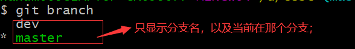
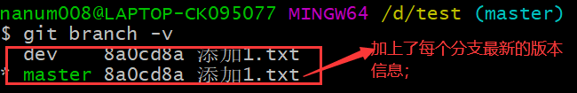

# 一、配置

### 全局配置

#### 配置全局用户名和邮箱地址

```shell
git config --global  user.name "这里换上你的用户名"
git config --global user.email "这里换上你的邮箱"
```

#### SSH密钥生成

```shell
ssh-keygen -t rsa -C "这里换上你的邮箱"
```

执行命令后需要进行3次或4次确认：

1. 确认秘钥的保存路径（如果不需要改路径则直接回车）；
2. 如果上一步指定的保存路径下已经有秘钥文件，则需要确认是否覆盖（如果之前的秘钥不再需要则输入yes覆盖，如需要保留则手动拷贝到其他目录后再覆盖）；
3. 创建密码（如果不需要密码则直接回车生成密钥）；
4. 确认密码；

#### 查看全局配置详情

```shell
1、git config --global --list
-------------------------------------------
2、git config --global -l
```


### 当前项目配置

##### 查看当前项目的配置详情

- 命令

```shell
git config --list
```

- 示例

  

# 三、文件操作

### 1、初始化Git项目

在任意一个目录下执行`git init`即可完成对git仓库的初始化，执行完`init`命令之后这个项目（目录）就是git项目了；

执行该命令后Git会在该目录下创建一个隐藏目录：`.git`，这个目录由git维护，里面有git的`版本库`；


### 2、查看工作区和暂存区的状态

执行命令：`git status`即可查看工作区和暂存区的状态；


### 3、文件的四种状态

- **untracked：未被追踪的；**

  新添加的文件，未被git管理，执行`add`命令后会被添加到暂存区当中，状态变为`staged`；

- **unmodify：文件已同步到版本库；**

  文件被提交到版本库当中，当文件为修改时状态变为`modified`；

  可执行`git rm`移出版本库，状态变为`untracked`；

- **modified：文件已修改；**

  文件被修改了，可以执行`add`命令添加到暂存区当中，文件状态变为`staged`；

- **staged：暂存状态；**

  文件被添加到暂存区了，执行`commit`命令同步到版本库当中，这时候文件就又变为`unmodify`的状态了；

  可以执行`git resset HEAD <文件名>`命令移出暂存区，文件状态变为`modified`；
  
  

### 4、添加文件到暂存区

- **添加单个文件到暂存区**
  - 命令：`git add <文件名>`
  
    当文件被添加到暂存区后，文件的状态就由`untracked`变为`staged`；
  
- **添加所有文件/目录到暂存区**

  - 命令：`git add .`

    这个命令会将git项目下所有的文件及文件夹添加到暂存区当中；
  
  

### 5、同步至版本库

命令：`git commit -m '这里填写版本描述信息'`会将暂存区的所有文件提交到版本库当中生成一个新的版本；

**说明：**

- 每一个版本都会生成一个hash值对其进行标识，以方便后续进行版本回退、前进；

- 也可以在命令末尾加上文件名以将指定文件从暂存区提交到版本库当中；


### 6、忽略文件：.gitignore

在忽略文件里记录的文件或目录，git


**语法规则**

在主目录下建立".gitignore"文件，此文件有以下规则∶

- 忽略文件中的`空行`或以`井号#`开始的行将会被忽略。

- 可以使用Linux通配符。

  星号`*`代表任意多个字符，问号`?`代表一个字符，方括号`[abc]`代表可选字符范围，大括号`{string1,string2,.…}`代表可选的字符串等。

- 名称的最前面有一个感叹号`!`，表示例外规则，将不被忽略。

- 名称的最前面是一个路径分隔符`/ `，表示要忽略的文件在此目录下，而子目录中的文件不忽略。

- 名称的最后面是一个路径分隔符`/`，表示要忽略的是该目录下该名称的子目录，而非文件(默认文件或目录都忽略)。


**示例**

```bash
# 符号：#为注释

# 忽略所有以 .txt 结尾的文件
*.txt
# 结合上一条语句，意思是lib.txtx文件除外
!lib.txt
# 忽略build目录下的所有文件
build/

```


### 7、撤销修改

当文件被修改了，但是还未被提交到暂存区时，可使用命令` git restore <文件名>`来撤销修改。但是一旦文件已经被提交到暂存区当中，该命令就不能撤销修改；


### 8、历史记录查询（日志）

我们可以使用命令：`git log`来查看每一条操作的历史记录，每一条操作记录都有对应的一个hash值，这个hash值就是每一条操作记录的唯一标识；


**1）分页查看**

当记录太多的时候，记录会被分页显示，当要查看下一页：`空格键`，查看上一页：`b`；

当查看到最后一页的时候会显示`(END)`符号来提示，按`q`键可退出查看；


**2）单行展示**

可以使用命令：`git log --pretty=oneline`来使每一条操作记录单行展示，这样更加美观，便于阅读；

**命令**：`gti log --oneline`的效果同`git log --pretty=oneline`相似，只是hash值只会显示前面几位；

**命令**：`git reflog`的效果同`git log --pretty=oneline`相似（推荐）；


### 9、文件差异比较

- 比较工作区与暂存区中文件的差异
  - 比较所有文件的差异：`git diff`；
  - 比较指定文件的差异：`git diff <文件名>`；

- 比较暂存区中的文件和版本库中的文件的差异
  - 命令：`git diff <不同版本的hash值>`；
  - 若要与最新一个版本的文件比对差异的话也可使用`HEAD`代替最新版本的hash值，即：`git diff HEAD` ；


### 10、版本回退、前进

**命令**：`git reset --hard <要回退或前进的版本的hash值>`


# 二、分支操作

### 1、创建分支

创建分支会将当前的所有文件复制一份到新创建的分支；

**命令**：`git branch <分支名>`


### 2、切换分支

**命令**：`git checkout <分支名>`

### 3、合并分支

在合并分支之前需要弄清楚：`将哪个分支合并到哪个分支`，然后再执行合并操作；


**示例**：假设需要将B分支合并到A分支：

1、首先切换到**A分支**：`git chekout A`；

2、然后将**B分支**合并到**A分支**：`git merge B`，这时就会产生一个新的版本；

​	2.1：倘若合并时产生了冲突

​			


### 4、为远程仓库创建别名

**命令**：`git rmeote <别名> 远程仓库地址`


### 5、查看所有的本地分支


- 只显示分支名：`git branch`

| 示例效果                  |
| ------------------------- |
|  |

- 显示分支名以及最新版本信息：`git branch -v`

| 示例效果                    |
| --------------------------- |
|  |

